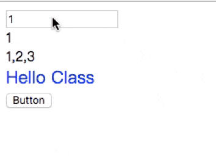

# Vue数据响应实现

### 前言
> 大家对`Vue`的数据响应已经着迷已久了吧, 下面项目实现

```html
<div id="app">
  <input type="text" v-model="test.a">
  <div>{{test.a}}</div>
  <div>list: {{list}}</div>
  <div v-class="className" class="init">Hello Class</div>
  <button v-on:click="changeClass">Button</button>
</div>
<script>
  var lue = new Lue ({
    el: '#app',
    data: {
      className: 'active',
      list: [1, 2, 3],
      test: {
        a: 1
      }
    },
    methods: {
      changeClass() {
        this.className = 'big-font'
      }
    }
  })
</script>
```

### 效果图




### 思路

其中最核心的方法便是通过Object.defineProperty()来实现对属性的劫持，达到监听数据变动的目的，
1、实现一个数据监听器Observer，能够对数据对象的所有属性进行监听，如有变动可拿到最新值并通知订阅者 
2、实现一个指令解析器Compile，对每个元素节点的指令进行扫描和解析，根据指令模板替换数据，以及绑定相应的更新函数
3、实现一个Watcher观察者，作为连接Observer和Compile的桥梁，能够订阅并收到每个属性变动的通知，执行指令绑定的相应回调函数，从而更新视图


### 监听Observer
通过`defineReactive`将`data`的每个属性都转化成访问属性,在每个属性(如上面的`className`)里的`set`和`get`都闭包引用自己的订阅器`dep`(也可以成为“框”)(这里的`value`也是闭包引用),执行`defineReactive`不会触发`className`的`get`, 而是在取值会触发,   `set`里会设置新值时触发
> `get`作用: 
* 收集观察者`new Watcher()`
* 返回正确值
> `set`作用:
* 设置新值
* 触发更新
```js
let defineReactive = (obj, key) => {
  var dep = new Dep()
  var value = obj[key]
  Object.defineProperty(obj, key, {
    enumerable: true,
    configurable: false,
    get () {
      // 由于需要闭包添加watcher, 所以通过Dep定义一个全局target属性,  暂存watcher, 添加完移除
      if (Dep.target) {
        dep.depend(Dep.target)
      }
      if (Array.isArray(value)) { // 让数组的变异方法pop等, 能取到它的订阅器
        Object.defineProperty(value, '__ob__', {
          value: dep,
          enumerable: false,
          writable: true,
          configurable: true
        })
      }
      return value // 这里闭包value变量, 能保存它不被销毁
    },
    set (newVal) {
      if (newVal === value) return
      value = newVal  //  改变value
      observer(value)
      dep.notify()
    }
  })
}
```

### Compile
取到`dom`, 遍历所有节点, 进行扫描解析编译, 对于有需要绑定的节点进行绑定(这是会执行相应的指令解析,更新视图(就是修改`dom`的某属性), 同时实例化`Watcher`, 将`updaterFn`更新视图函数(功能:修改`dom`)作为回调函数), 其中`updaterFn`会闭包引用对应节点`node`, 但该属性更新时直接触发它对-对应`node`节点修改.
外: `v-model`其实就是给`input`添加监听事件, 一改变输入就出发更新
```js
class Compile{
  constructor (el, vm) {
    this.$vm = vm
    this.$el = this.isElementNode(el) ? el: document.querySelector(el)
    
    if (this.$el) {
      this.$fragment = this.node2Fragment(this.$el)
      this.init()
      this.$el.appendChild(this.$fragment)
    }
  }
  node2Fragment(el) {
    var fragment = document.createDocumentFragment()

    var child
    // // 将原生节点拷贝到fragment
    while (child = el.firstChild) {
      fragment.appendChild(child)
    }
    return fragment
  }
  init() {
    this.compileElement(this.$fragment)
  }
  compileElement (el) {
    var childNodes = el.childNodes
    var compiler  = this;
    [].slice.call(childNodes).forEach(function(node) {
      var text = node.textContent
      var reg = /\{\{(.*)\}\}/  //  表达式文本
      // 按元素节点方式编译
      if (compiler.isElementNode(node)) {
        compiler.compile(node)
      } else if (compiler.isTextNode(node) && reg.test(text)) {
        compiler.compileText(node, RegExp.$1)
      }
      // 编译遍历子节点
      if (node.childNodes && node.childNodes.length) {
        compiler.compileElement(node)
      }
    })
  }
  compile(node) {
    var nodeAttrs = node.attributes
    var compiler = this;
    [].slice.call(nodeAttrs).forEach(function (attr) {
      // 规定 : 指令以v-xxx
      var attrName = attr.name //
      if (compiler.isDirective(attrName)) {
        var exp = attr.value
        var dir = attrName.substring(2)
        if (compiler.isEventDirective(dir)) {
          // 事件指令  如v-on:click
          compileUtil.eventHandler(node, compiler.$vm, exp, dir)
        } else {
          // 普通指令
          compileUtil[dir] && compileUtil[dir](node, compiler.$vm, exp)
        }
        node.removeAttribute(attrName)
      }
    })
  }
  compileText(node, exp) {
    compileUtil.text(node, this.$vm, exp)
  }
  isDirective(attr) {
    return attr.indexOf('v-') === 0
  }
  isEventDirective (dir) {
    return dir.indexOf('on') === 0
  }
  isElementNode (node) {
    return node.nodeType == 1
  }
  isTextNode (node) {
    return node.nodeType == 3
  }
}

var compileUtil = {
  text: function(node, vm, exp) {
    this.bind(node, vm, exp, 'text')
  },
  html: function (node, vm, exp) {
    this.bind(node, vm, exp, 'html')
  },
  model: function (node, vm, exp) {
    this.bind(node, vm,  exp, 'model')  // 订阅的
    var me = this
    var val = this._getVMVal(vm, exp)
    node.addEventListener('input', function (e) {
      var newValue = e.target.value
      if (val === newValue) {
        return
      }
      me._setVMVal(vm, exp, newValue)
      val = newValue
    })
  }, 
  class: function (node, vm, exp) {
    this.bind(node, vm, exp, 'class')
  },
  bind: function (node, vm, exp, dir) {
    var updaterFn = updater[dir + 'Updater']  // 更新对应dom的值
    // 第一次初始化视图
    updaterFn && updaterFn(node, this._getVMVal(vm, exp)) // 可能是嵌套的结构, 所以用this._getVMVal(vm, exp)
    // 实例化订阅者, 此操作会在对应的属性信息订阅器中添加了改订阅watcher
    new Watcher(vm, exp, function(value, oldValue) {
      // 一旦属性值有变化, 会收到通知执行此更新函数,更新视图
       // 闭包引用了node
      updaterFn && updaterFn(node, value, oldValue)
    })
  },
  eventHandler: function (node, vm, exp, dir) {
    var eventType = dir.split(":")[1]
    var fn = vm.$options.methods && vm.$options.methods[exp]
    if (eventType && fn) {
      node.addEventListener(eventType, fn.bind(vm), false)
    }
  },
  _getVMVal: function (vm, exp) {
    var val = vm
    exp = exp.split('.')
    exp.forEach(function(key) {
      val = val[key]
    })
    return val
  },
  _setVMVal: function (vm, exp, value) {
     var val = vm
     exp = exp.split('.')
     exp.forEach(function (key, i) {
       // 非最后一个key,更新val的值
       if (i < exp.length - 1) {
         val = val[key]
       } else {
         val[key] = value
       }
     })
  }
}

var updater = {
  textUpdater: function (node, value) {
    node.textContent = typeof value == 'undefined'? '': value
  },
  htmlUpdater: function (node, value) {
    node.inneerHTML = typeof value == 'undefined' ? '':value
  },
  classUpdater: function (node, value, oldValue) {
    var className = node.className
    className = className.replace(oldValue, '').replace(/\s$/,'')  // 替换空白字符
    var space = className && String(value) ? ' ': ''
    node.className = className + space + value
  },
  modelUpdater: function (node, value, oldValue) {
    node.value = typeof value == 'undefined'? '':value
  }
}
```

### 观察者Watcher
`Watcher`订阅者作用:
* 往每个数据属性里(如上例的`className`)添加自身`new Wathcer()`
* 数据变化时, set() `---》` dep.notify() `---》` (new Wathcer()).update()  `---》` 执行回调`updaterFn`  `---》` 更新视图

```js
var uid = 0
class Watcher {
  constructor (vm, expression, cb) {
    this.vm = vm
    this.cb = cb
    this.id = uid++
    this.expression = expression
    this.depIds = new Set()  // 类似数组
    this.test = []
    // 此处为了触发属性的getter, 从而在dep上添加自己, 结合Observer
    this.getter = this.parseGetter(expression)
    this.value = this.get()
  }
  get () {
    Dep.target = this
    var value = this.getter.call(this.vm, this.vm)  // 这里会触发属性的getter,从而添加订阅者
    Dep.target = null
    return value
  }

  addDep(dep) {
    //2. 假如相应属性的dep.id已经在当前watcher的depIds里，说明不是一个新的属性，仅仅是改变了其值而已
    // 则不需要将当前watcher添加到该属性的dep里
    var id = dep.id
    if (!this.depIds.has(id)) {  // 
      dep.addSub(this)
      this.depIds.add(id)
      this.test.push(id)
    }
  }

  run () {
    var value = this.get()  // 取到最新值
    var oldVal = this.value  // 旧的值
    if (value !== oldVal) {
      this.value = value
      this.cb.call(this.vm, value, oldVal)  // 执行Compile中绑定的回调, 更新视图
    } else if (Array.isArray(value)) {
      // 由于数组是引用类型, oldValue会和value一起改变, 所以相同, 直接执行回调, 更新视图
      this.cb.call(this.vm, value, oldVal)  
    }
  }

  update () {
    this.run()
  }

  // 解析深度嵌套数据, 得到值
  parseGetter (expression) {
    if (/[^\w.$]/.test(expression)) return
    var expressions = expression.split('.')
    return function (obj) {
      for (var i = 0; i < expressions.length; i++ ) {
        if (!obj) return
        obj = obj[expressions[i]]  // 取值过程, 触发收集机制
      }
      return obj
    }
  }
}

```


### 构造器

```js
class Lue {
  constructor (options) {
    const vm = this
    vm.$options = options
    let data = vm._data = vm.$options.data
    for (let key in  vm._data) {
      proxy(vm, '_data', key)
    }
    observer(vm._data)
    this.$compile = new Compile(options.el || document.body, this)
  }
}
```


### 参考
[参考链接](https://github.com/DMQ/mvvm)